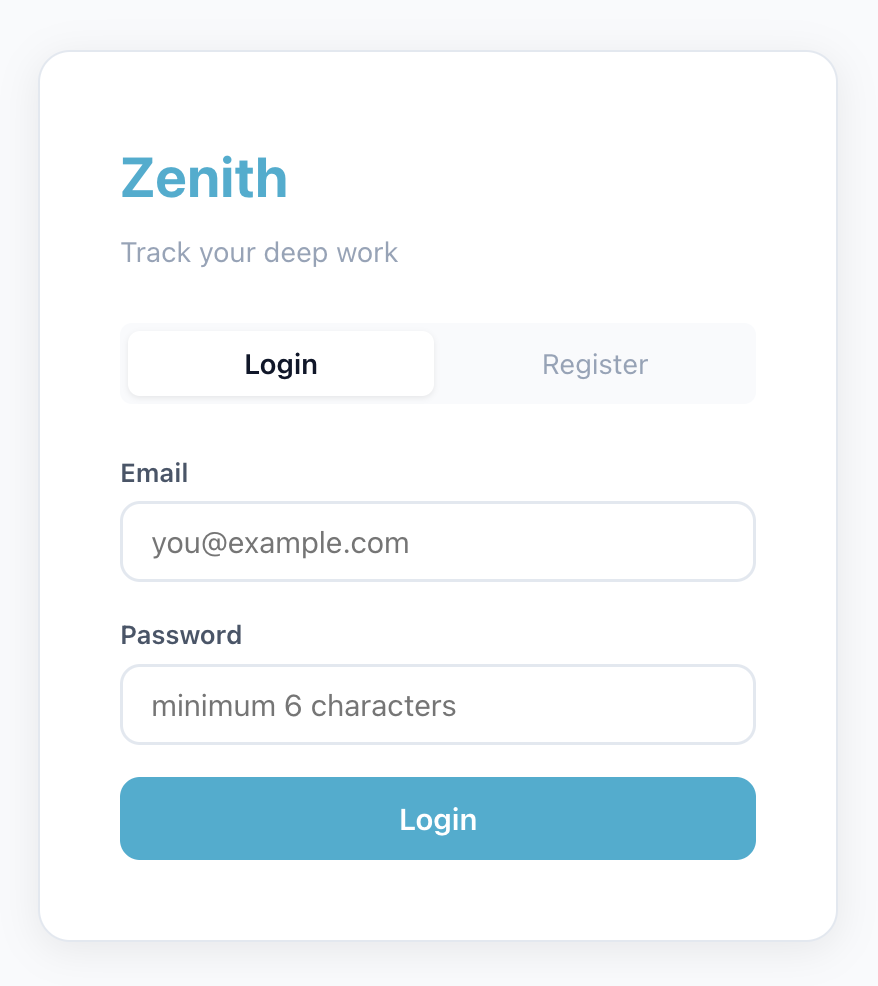
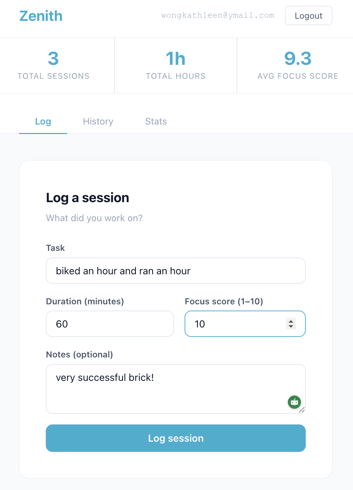
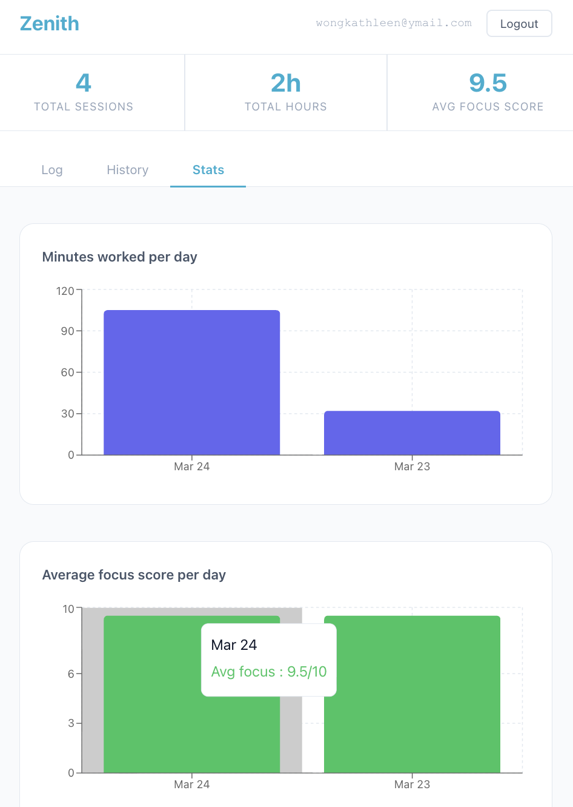
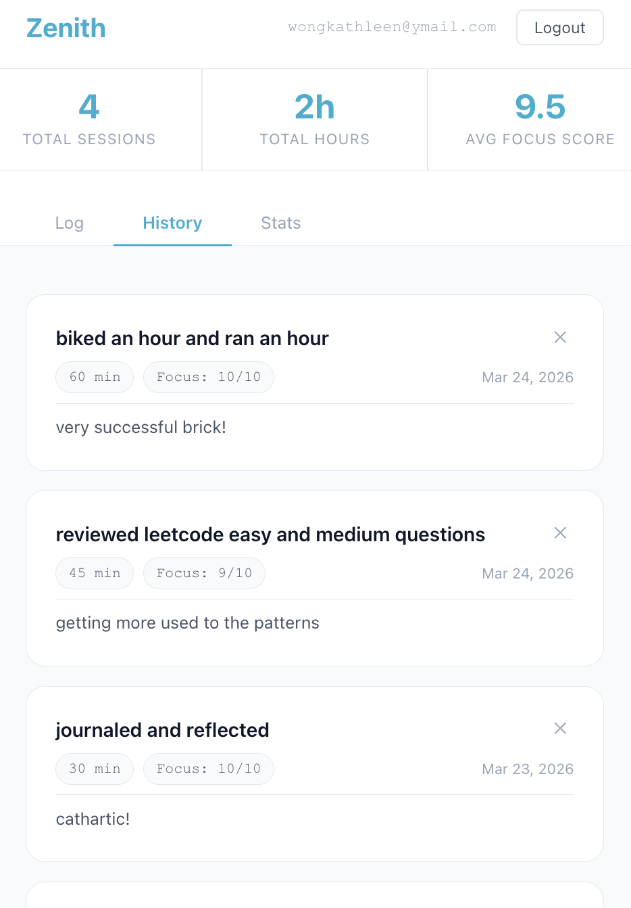
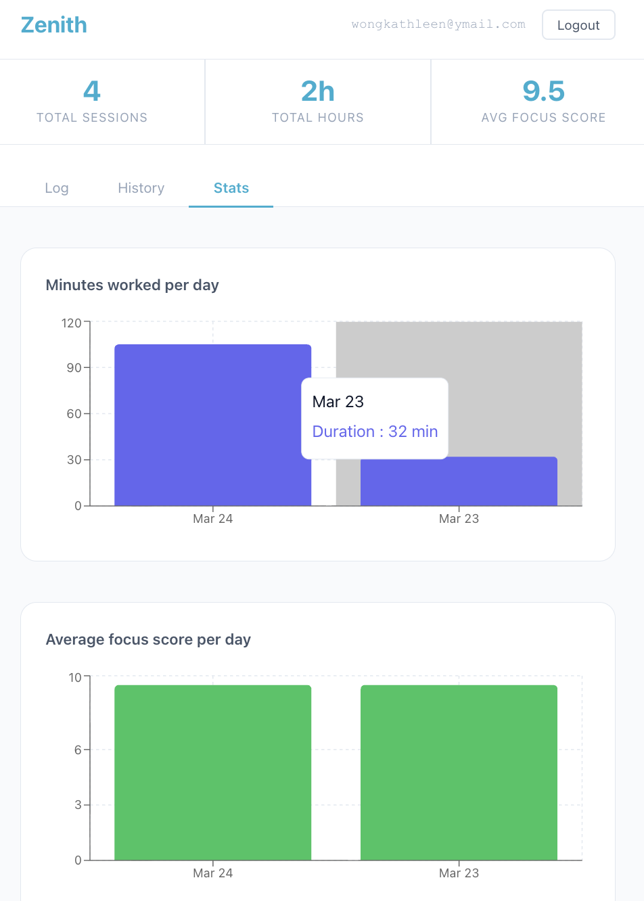

# Focus Tracker

A full stack productivity app for logging and analyzing deep work sessions. Track what you worked on, how long, and how focused you felt — then visualize your patterns over time.

**[→ Live Demo](https://zenith-sage-ten.vercel.app/)**  |  **[→ API](https://focus-tracker-api.railway.app)**









---

## What it does

Log focus sessions with a task name, duration, and focus score (1–10). View your history, delete old sessions, and see a bar chart of your weekly output. Each user's data is private — protected by JWT authentication.

---

## Tech stack

| Layer | Choice | Why |
|---|---|---|
| Frontend | React 18 + Vite | Fast dev server, component-based UI |
| Styling | CSS Modules + custom properties | Scoped styles, dark mode support |
| HTTP client | Axios | Cleaner than fetch, base URL config, auto JSON parse |
| Backend | Node.js + Express | Lightweight REST API, easy middleware pattern |
| Database | PostgreSQL | Relational data, foreign key constraints |
| Auth | JWT + bcrypt | Stateless auth, industry standard password hashing |
| Hosting | Railway (API + DB) + Vercel (frontend) | Zero-config deploys, free tier |

---

## Project structure

```
focus-tracker/
├── server/                  # Express backend
│   ├── index.js             # Entry point, middleware setup
│   ├── db.js                # PostgreSQL connection pool
│   ├── .env                 # Secrets — never committed
│   ├── routes/
│   │   ├── auth.js          # POST /auth/register, POST /auth/login
│   │   └── sessions.js      # GET/POST/DELETE /sessions
│   ├── middleware/
│   │   └── auth.js          # JWT verification middleware
│   └── db/
│       ├── setup.sql        # Table definitions
│       └── seed.js          # Runs setup.sql against the database
│
└── client/                  # React frontend
    └── src/
        ├── api/
        │   └── axios.js     # Base URL + auth header config
        ├── components/
        │   ├── LogSession.jsx
        │   ├── SessionList.jsx
        │   └── StatsChart.jsx
        ├── pages/
        │   ├── Login.jsx
        │   └── Dashboard.jsx
        ├── App.jsx
        ├── App.module.css
        └── index.css
```

---

## Architecture

```
React frontend (Vercel)
        ↓
    axios + JWT token in Authorization header
        ↓
Express API (Railway)
        ↓
middleware/auth.js verifies JWT on every /sessions request
        ↓
routes/sessions.js queries PostgreSQL with user_id from token
        ↓
PostgreSQL (Railway) — sessions table, users table
```

---

## API routes

| Method | Endpoint | Auth required | Description |
|---|---|---|---|
| POST | /auth/register | No | Create account, returns JWT |
| POST | /auth/login | No | Login, returns JWT |
| GET | /sessions | Yes | Get all sessions for logged-in user |
| POST | /sessions | Yes | Log a new session |
| DELETE | /sessions/:id | Yes | Delete a session (own sessions only) |

---

## Database schema

```sql
CREATE TABLE users (
  id            SERIAL PRIMARY KEY,
  email         TEXT UNIQUE NOT NULL,
  password_hash TEXT NOT NULL,
  created_at    TIMESTAMP DEFAULT NOW()
);

CREATE TABLE sessions (
  id          SERIAL PRIMARY KEY,
  user_id     INTEGER REFERENCES users(id) ON DELETE CASCADE,
  task        TEXT NOT NULL,
  duration    INTEGER NOT NULL,
  focus_score INTEGER NOT NULL,
  notes       TEXT,
  created_at  TIMESTAMP DEFAULT NOW()
);
```

---

## Key decisions and tradeoffs

| Decision | Alternative | Why I chose this |
|---|---|---|
| JWT over sessions | Cookie-based sessions | Stateless — server doesn't store session data, scales easily |
| Raw SQL over ORM | Prisma / Sequelize | Forces real SQL knowledge; easier to debug what's actually running |
| bcrypt salt rounds = 10 | Higher/lower | Industry standard — secure enough, fast enough |
| PostgreSQL over MongoDB | MongoDB | Relational data with foreign keys fits this use case better |
| Axios over fetch | fetch | Base URL config + auth header injected once, not on every call |
| CSS Modules over Tailwind | Tailwind | Scoped styles, closer to what production React codebases use |

---

## Security decisions worth noting

**Passwords** — never stored in plain text. bcrypt hashes with 10 salt rounds before insertion. On login, `bcrypt.compare()` hashes the attempt and compares — the original password is never recoverable.

**SQL injection** — all queries use parameterized placeholders (`$1, $2`) never string interpolation. Prevents attackers from injecting SQL through user input.

**Authorization** — the DELETE route checks both `id` AND `user_id`. A logged-in user cannot delete someone else's session by guessing an ID.

**Generic auth errors** — login returns "Invalid credentials" whether the email doesn't exist or the password is wrong. Specific errors would tell attackers which emails are registered.

---

## Running locally

**Backend:**
```bash
cd server
npm install
# create .env with DATABASE_URL and JWT_SECRET
npm run setup-db   # creates tables
npm run dev        # starts on port 3001
```

**Frontend:**
```bash
cd client
npm install
npm run dev        # starts on port 5173
```

---

## What I'd add next

- Edit session — update task or focus score after logging
- Tags — categorize sessions (deep work, meetings, learning)
- Weekly email summary using a cron job + Nodemailer
- OAuth — sign in with Google instead of email/password

---

## What I learned

This project is where backend concepts clicked for me. Writing raw SQL made me understand what ORMs are abstracting. Building JWT auth from scratch — hashing passwords, signing tokens, verifying middleware — meant I actually understand how login systems work rather than just using a library that does it for me. Connecting a React frontend to an API I built myself made the full request lifecycle concrete in a way tutorials never did.
